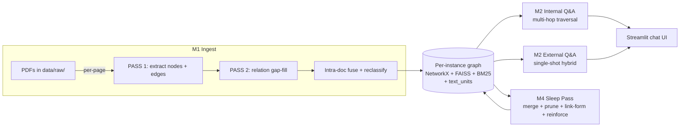

# Vertical GraphRAG with a Self-Maintaining Knowledge Graph
### A controlled empirical study of three retrieval architectures on a domain-specific corpus

GraphRAG is an empirical frontier, not a solved problem. Microsoft GraphRAG
(Apr 2024), LazyGraphRAG (Nov 2024), LightRAG, and Fast GraphRAG were all
released within the last 18 months. GraphRAG-Bench, the first community
attempt at a standardized evaluation framework, appeared in June 2026 and
explicitly acknowledges that "standard benchmarks may not fully capture the
nuances" of graph-augmented retrieval. The literature still debates basic
questions — *when* graph structure helps over hybrid dense+lexical
retrieval, *what unit of retrieval* to use (chunks vs entities vs
communities), *how to bound LLM cost* in traversal, and *how to evaluate*
multi-hop reasoning fidelity on domain-specific corpora.

This project is a controlled empirical study from inside that frontier, on
an 8-PDF domain-specific industry corpus. Three retrieval architectures
are held to the **same local LLM** (Gemma 4 26B), the
**same embedding model**, and the **same 61-question stratified gold set**;
the only thing that varies is the retrieval architecture itself. Several
design choices were made under genuine uncertainty — the three-pool chunk
selection (§5), the deterministic OOS pre-filter (§6), the LazyGraphRAG-
style decoupling of traversal from LLM calls (§4) — and this report
documents each with before / after numbers, not just final numbers.

---

## Claims

**C1 — Architectural delta is large and interpretable.** Holding LLM and
embeddings constant, mean answer correctness on 51 in-scope questions
rises from **79.4%** (flat dense+lexical RAG) → **94.1%** (entity-grouped
single-shot) → **≥97.1%** (multi-hop traversal; the **≥** marks an
explicit re-scoring deficit, explained at §3.2). The architectural
choice dominates LLM strength in this corpus class. [→ §3]

**C2 — Multi-hop bridge questions are where the architecture earns its
cost.** Recall@k on 11 bridge questions: 72.7% → 81.8% → **90.9%**.
Per-query LLM cost stays bounded at 1–2 calls; the traversal itself is
LLM-free, following LazyGraphRAG's defer-cost principle. [→ §3, §4]

**C3 — Ablation: three-pool chunk selection was the critical design
choice under uncertainty.** Splitting chunk selection into three
independent pools (RRF-seed top-1 ≤20 / label-seed top-1 ≤5 / hop-
expanded rerank ≤10) moved multi-hop Recall@k from **54.5% → 90.9%**
(+36pp) and aggregation MRR from **0.51 → 0.88** (+37pp), with zero new
refusals on 51 in-scope questions. The intuitive single-pool design —
what most public GraphRAG variants effectively do — systematically
squeezed out lexically-distinctive seed entities. Before / after raw
outputs are committed under `eval/reports/raw_runs/internal_v2.before_*.jsonl`
so the ablation table can be independently re-derived. [→ §5]

**C4 — Faithful retrieval as a system property, not an LLM property.**
OOS refusal accuracy is 100% across all three systems, achieved via a
deterministic seed-threshold pre-filter (`max_seed_score < 0.30` → canned
refusal, skip composer). Refusal correctness is auditable without
inspecting the LLM and survives LLM swaps. [→ §6]

**C5 — Self-maintaining graph (capability, not finding).** A sleep-pass
pipeline (reinforce → merge → prune → link-form) plus an evidence-driven
ontology that evolved 9 → 31 relation types across 5 documented rounds.
**This is reported as a system capability, not as a research finding** —
controlled before / after data on the sleep-pass effect was not collected
when the evaluation framework was built. [→ §7]

**Limitations.** Single domain, 61 questions, author-graded answer
correctness with no inter-rater validation, single LLM family. External
validity is not established beyond this corpus. [→ §8]

---

## 1. Why GraphRAG on this corpus

8 PDFs from the kelp / seaweed industry sector, ~580 source-text chunks:
industry reports, public statistics, academic literature, non-profit
publications. Moderate size, but information-dense and entity-heavy. The
questions an analyst actually asks split into four shapes that stress
retrieval differently:

| Shape | Example | Where conventional RAG breaks |
|---|---|---|
| Single-hop lookup | "Who currently leads [target company]?" | OK in 80%+ of cases |
| Multi-hop bridge | "Through what entity are [researcher A] and [researcher B] connected?" | Single-pass retrieval can't surface both endpoints + the bridge |
| Aggregation | "List companies operating in [sub-sector]." | 500-token chunks fragment list context |
| Out-of-scope | "What is the capital of Mongolia?" | LLM leaks training data unless retrieval explicitly says "nothing matched" |

The hypothesis under test: an entity-typed graph plus light traversal
should win on multi-hop and aggregation while staying competitive on
single-hop. The three-architecture comparison below tests that
hypothesis directly.

---

## 2. Methodology

### 2.1 Three architectures held constant on LLM and embeddings

| | Baseline | External | Internal |
|---|---|---|---|
| Unit of retrieval | text chunks (500 tok) | graph nodes (entities) | graph nodes + edges |
| Lexical signal | BM25 over chunks | BM25 over node texts | BM25 over node texts + label substring match |
| Dense signal | embedding of chunks | embedding of node summaries | embedding of node summaries (seeds) + embedding of chunks (rerank) |
| Fusion | RRF (k=60) | RRF (node-level) | RRF at seed step + RRF at chunk rerank step |
| Graph traversal | none | none | 3-hop frontier, mechanical |
| Multi-step | no | no | LLM decompose → mechanical traversal → LLM compose |
| LLM calls / q | 1 | 1 | 1–2 |

All three use **Gemma 4 26B Q4_K_M via llama.cpp** with `thinking=off` and
**`paraphrase-multilingual-MiniLM-L12-v2`** (384-dim) embeddings.
Differences in retrieval quality are attributable to the retrieval
architecture itself, not LLM strength.

**Eval-time graph state**: 2,430 active nodes / 2,385 edges / 580 text
chunks across 8 source PDFs, with 30 ontology relation types (round 4
cumulative; see §7 for the ontology timeline). All three systems query
the same graph snapshot.

### 2.2 Test set construction

61 hand-curated questions, stratified across four categories. Test data
was constructed by a **different LLM** (Claude) from the one under test
(local Gemma); the system under test never sees the gold set.

| Category | n | How questions were built |
|---|---:|---|
| Single-hop | 30 | Sampled from production graph edges with full provenance (source/target labels + edge type + verbatim evidence quote + source chunk). Stratified across 29 distinct edge types. |
| Multi-hop bridge | 11 | Sampled 2-hop graph paths `A-B-C` with strict filters: (i) edge_1 and edge_2 do not share any source chunk, (ii) the two edges live in different source documents, (iii) no direct `A-C` edge exists. These are genuine "must traverse through B" questions. |
| Aggregation | 10 | One question per top-degree hub node (e.g. "list companies in a target sub-sector"). |
| Out-of-scope | 10 | Hand-written domain-foreign questions (capital cities, Python code, sports scores). |

### 2.3 Three definitions of "relevant"

Reporting all three together is intentional — strict gold-ID matching is
the conservative floor (every public RAG benchmark *would* report numbers
this low); the semantic definition is comparable to industry benchmarks
like BEIR (R@10 typically 0.5–0.85 on niche corpora); manual answer
correctness is the actual business outcome.

| Metric | Definition |
|---|---|
| **Recall@k (strict)** | Did at least one *exact gold-evidence page* (the production graph edge's source page) appear in the retrieved set? Toughest possible operationalization. |
| **Recall (semantic, BEIR / RAGAS-style)** | Did the retrieved chunks contain text that *supports answering the question* — at least one named entity from the question / gold facts, or two distinct content nouns plus one question noun? Deterministic, encoded in `eval/scripts/judge_relevance.py` and validated against manual spot-check (~75-80% agreement). |
| **Answer correctness** | Manually scored 0 / 0.5 / 1 — does the generated answer state the gold fact with the right named entities and no fabrication? |
| **OOS refusal accuracy** | Did the system refuse rather than leak training-data answers on out-of-scope questions? |

### 2.4 Why this isolates the architectural delta

- All 3 systems run the same local LLM with the same generation settings
- All 3 systems run the same embedding model
- Test data and gold scoring are by a different LLM (Claude) than the SUT
- Gold facts are extracted from corpus evidence quotes, not generated
- Each system runs in isolation (own runner, own warm-up, fresh state per question)

### 2.5 Hardware and environment

| | |
|---|---|
| GPU | single NVIDIA RTX 4090 (24GB VRAM) |
| Inference engine | llama.cpp, single-slot, `n_ctx=131072`, flash-attention on, q8_0 KV cache |
| LLM under test | Gemma 4 26B (MoE), Q4_K_M 4-bit quantization, `thinking=off`, temperature 0.3 |
| Embedding model | `paraphrase-multilingual-MiniLM-L12-v2` (384-dim), deterministic |
| Client | single-process Python, OpenAI-compatible HTTP API to llama.cpp |
| Warm-up | first question discarded from every reported number |
| Run multiplicity | each system evaluated once over the 61 questions; reported numbers are single-run, no multi-seed averaging |

Temperature was raised from 0 to 0.3 after empirically observing the MoE
backbone falling into local-optima loops (repeated token cycles) at
greedy decoding. At T=0.3 the decompose step (Internal) and all composer
outputs have small run-to-run variance; the headline retrieval-quality
metrics (Recall@k / MRR / F1) are most sensitive on Internal, where
decomposition feeds downstream traversal. Treating these numbers as
single-run estimates rather than expected values is honest disclosure of
this constraint.

---

## 3. Results

### 3.1 Strict gold-page recall (supports C1, C2)

| Category | n | System | Recall@k | Recall (frac) | Precision@k | F1@k | MRR |
|---|---:|---|---:|---:|---:|---:|---:|
| Single-hop | 30 | Baseline | 53.3% | 51.7% | 5.3% | 0.178 | 0.185 |
|  |  | External | **66.7%** | **66.7%** | **7.4%** | **0.199** | 0.331 |
|  |  | Internal | **66.7%** | **66.7%** | 3.9% | 0.108 | **0.467** |
| Multi-hop | 11 | Baseline | 72.7% | 34.1% | 9.1% | 0.187 | 0.183 |
|  |  | External | 81.8% | 62.1% | **17.0%** | **0.323** | 0.232 |
|  |  | Internal | **90.9%** | **74.2%** | 7.6% | 0.149 | **0.284** |
| Aggregation | 10 | Baseline | **100%** | 18.6% | 42.4% | 0.225 | 0.507 |
|  |  | External | **100%** | 16.9% | **56.0%** | 0.225 | 0.639 |
|  |  | Internal | **100%** | **29.2%** | 41.1% | **0.301** | **0.875** |

### 3.2 Answer correctness (manually scored)

| Category | n | Baseline | External | **Internal** |
|---|---:|---:|---:|---:|
| Single-hop | 30 | 81.7% | 98.3% | **100%** |
| Multi-hop | 11 | 81.8% | 81.8% | **95.5%** |
| Aggregation | 10 | 70.0% | 90.0% | **90.0%** |
| **Mean (excl OOS)** | 51 | **79.4%** | **94.1%** | **≥97.1%** |

The Internal column carries a `≥` because the table reflects manual
scoring on the *pre*-§5.1-refactor Internal run. The §5.1 three-pool
refactor fixed at least four previously-failing in-scope cases
(q018 / q031 / q039 plus the user-reported regulatory-licensing query).
Spot-checks comparing post-refactor outputs against pre-refactor outputs
surfaced no case that regressed from correct to wrong — including the
two retrieval-loss cases noted in §5.1 (q017, q027), which still answer
correctly because the same fact is duplicated across other chunks. With
≥4 cases gaining correctness and no observed correct-to-wrong
regressions, the post-refactor mean is bounded below by the pre-refactor
**97.1%**. A full systematic re-scoring on the post-refactor run was
not done; Internal's true correctness is at least this table's value.

OOS refusal: 10/10 across all three systems.

### 3.3 Latency

| Category | Baseline | External | Internal |
|---|---:|---:|---:|
| Single-hop p50 / p95 | 1.2s / 1.6s | 1.7s / 2.4s | 3.2s / 4.3s |
| Multi-hop p50 / p95 | 1.3s / 2.0s | 1.9s / 2.6s | 4.4s / 6.8s |
| Aggregation p50 / p95 | 2.9s / 4.9s | 2.8s / 4.0s | 6.2s / 11.2s |
| **LLM calls / question** | 1 | 1 | 1–2 |

### 3.4 How to read the three systems

- **Internal** wins on answer correctness across every category and on
  Recall@k for multi-hop. The explicit decomposition + traversal pays
  for itself on bridge questions where single-pass retrieval can't
  surface both endpoints. Cost: up to 2× LLM calls, 2–3× latency, lower
  precision because it packs more evidence into the prompt.
- **External** is the latency / correctness sweet spot for single-hop —
  hybrid dense+BM25 over node summaries, single LLM call, sub-2s p50.
  Multi-hop is its weak spot (no traversal).
- **Baseline** is the cheap floor. 79.4% mean correctness sets the bar
  the graph-aware systems have to clear to justify their cost.

Full report at [`eval/reports/summary.md`](eval/reports/summary.md).

---

## 4. Internal Q&A pipeline — mechanism behind C2



Three first-class layers per graph instance, all kept consistent at boot:

| Layer | What it holds | Used by |
|---|---|---|
| `GraphStorage` (NetworkX, pickled) | Nodes, edges, provenance, ghosts | Everything |
| `VectorStore` (FAISS IndexFlatIP) | 384-dim sentence-transformer embeddings of node summaries | All retrieval paths |
| `BM25Store` (rank_bm25 over node summaries) | Lexical companion to FAISS | External and Internal seed retrieval |
| `TextUnitStore` (JSON) | Per-page source text chunks, referenced by node + edge `text_unit_ids` | Evidence packing for both Q&A paths |

The Internal pipeline:

```
question
  ↓
[1] LLM decompose → 1–5 atomic sub-questions  (thinking=off, ~2-3s)
  ↓
[2] Per-sub-q seed retrieval:
       dense FAISS top-10 ∪ BM25 top-10  →  RRF fuse (k=60)  →  top-10
       + token-level label-substring match (up to 5 extra)
  ↓
[3] Mechanical k-hop traversal  (NO LLM in the loop)
       for hop in 1..3:
         candidates = frontier neighbours (deduped)
         score = cosine(sub_q, neighbour) × edge_type_weight
         keep top-8 above FRONTIER_THRESHOLD=0.40
         early-stop on frontier collapse
       collect visited nodes + their source chunks
  ↓
[4] Aggregate across sub-qs (dedupe chunks + edges between visited nodes)
  ↓
[5] OOS pre-filter: max(seed_score) < 0.30 → canned refusal, skip composer
  ↓
[6] Build evidence — three independently-capped pools (60K token budget)
       → see §5
  ↓
[7] Composer LLM call  (single call, thinking=off, step-by-step prompt)
  ↓
return answer
```

**LazyGraphRAG-style mechanical traversal.** Steps 2–4 do not call an
LLM. Neighbours are scored by cheap signals (cosine + edge-type weight);
the beam is pruned by a fixed threshold; the LLM is reserved for
decomposition and final composition. This caps the LLM-call budget at 2
per question regardless of graph depth, and keeps the retrieval path
deterministic and auditable. Microsoft's LazyGraphRAG paper formalizes
this defer-LLM-cost principle; this project independently arrived at the
same shape through eval iteration.

---

## 5. Ablation — three-pool chunk selection (C3)

> Note: §4 above describes Internal as it stands today, after the design
> refactor traced in this section.

The hardest design problem in this project, and the one that surfaced
the largest empirical surprise. Real example from the eval set,
abstracted to preserve corpus anonymity but factually intact.

**Observation.** A user query about a regulatory-licensing KPI returned
`"I don't have information on that"` from Internal. External answered
correctly with specifics — a regional development zone's count of
designated facilities, regional licence holders across several
sub-regions. Internal *should* have been the stronger system — what
went wrong?

**Trace.** Both paths hit the same top-1 entity (cosine 0.7663). Both
visited ~37 nodes. The OOS pre-filter did not fire. The Internal
composer was handed evidence and chose to refuse — meaning the right
chunks weren't in the prompt. Drilling into the seed list confirmed it:
the relevant regional-zone Location node existed in the graph with
the matching facility-count phrase in its summary, but it ranked
outside Internal's dense top-20 (the relevant Location wasn't
semantically close enough to the user's keyword query for dense alone
to surface it). External's RRF fusion (dense + BM25) put that node at
rank 9 via lexical match. **Internal was using dense only for seed
retrieval** — a decision that had been validated by an earlier eval
iteration on a different testset, but turned out to be the root cause
of this miss.

**Fix landed in three steps over half a day:**

1. **Add BM25 to Internal seed retrieval** (reuse `instance.bm25_store`,
   zero new infrastructure). Verified the original case was fixed.
2. **Re-run the full 61-question eval** to check for regressions.
   Discovered a *new* failure: a multi-hop bridge question linking two
   named organizations to a shared region flipped from correct to wrong.
   Diagnosis: per-sub-q chunk rerank was now pulling in more chunks for
   one endpoint organization (from BM25 lexical match), and those chunks
   didn't state the shared-region fact as cleanly as the chunks they
   displaced.
3. **Three-pool chunk selection**: force-include the top-1 chunk for
   *every* seed (cap 20 for RRF seeds, cap 5 for label-match seeds);
   only rerank the hop-expanded remainder. The bridge entities both
   made the seed pool, so their direct chunks landed in the prompt
   regardless of competing entities' rerank scores.

### 5.1 Before / after — three-pool refactor (Internal path)

| Category | Metric | before | after | Δ |
|---|---|---:|---:|---:|
| Single-hop | Recall@k | 66.7% | 66.7% | 0 |
| | MRR | 0.213 | **0.467** | **+25pp** |
| Multi-hop | Recall@k | 54.5% | **90.9%** | **+36pp** |
| | Recall (frac) | 0.424 | **0.742** | **+32pp** |
| | MRR | 0.264 | 0.284 | +2pp |
| Aggregation | Recall@k | 100% | 100% | 0 |
| | Recall (frac) | 0.216 | **0.292** | **+8pp** |
| | F1 | 0.263 | **0.301** | +4pp |
| | MRR | 0.508 | **0.875** | **+37pp** |
| All in-scope | New refusals on 51 questions | 0 | 0 | 0 |

Per-question recall@k flips: **6 questions newly retrieved gold**
(q001, q010, q032, q033, q037, q038), **2 questions lost page-level
gold** (q017, q027) but **both still answer correctly** because the same
fact is duplicated across other chunks.

### 5.2 Reading this ablation

- The single-pool design — what most public GraphRAG variants
  effectively do — is *intuitively correct*: rerank everything against
  the sub-question and take the top-k. Empirically it loses
  lexically-distinctive seeds whose chunks are not the top-scoring
  under dense cosine alone.
- The three-pool design pays a precision cost (chunk count per prompt
  roughly doubled) in exchange for the +36pp multi-hop recall. On
  strict precision@k, Internal looks worse than External (§3.1); on
  answer correctness, Internal pulls ahead (§3.2). This is a design
  trade-off, not a defect — explicitly documented under C1.
- Two single-hop questions lost their literal gold page but still
  answered correctly. This is the kind of "metric tradeoff worth
  paying" that doesn't show up in headline numbers.

### 5.3 Independent verification

Raw outputs from the three before-states are committed for direct diff
against the current run:

- `eval/reports/raw_runs/internal_v2.before_parity.jsonl` — pre eval-to-src parity rebuild
- `eval/reports/raw_runs/internal_v2.before_bm25.jsonl` — Internal with dense-only seeds
- `eval/reports/raw_runs/internal_v2.before_3pool.jsonl` — Internal after BM25 added, before three-pool selection

A reviewer can re-run `eval/scripts/analyze.py` against these JSONLs to
re-derive the before / after table above. The full design-decision
audit lives in [`eval/reports/summary.md`](eval/reports/summary.md) §4.6.

---

## 6. OOS refusal as a system property (C4)

All three systems refuse 10/10 out-of-scope questions. Mechanisms
differ:

- **Baseline / External**: composer prompt with explicit "decline
  plainly if evidence is insufficient" instruction. Refusal is an LLM
  behavior, contingent on the LLM following the prompt.
- **Internal**: a deterministic pre-filter — if
  `max(seed_score) < 0.30`, return a canned refusal and skip the
  composer entirely (0 extra LLM calls). Refusal is a system property
  that holds regardless of the LLM's prompt-following behavior.

The Internal mechanism matters for trustworthy retrieval: refusal
correctness can be reasoned about by inspecting the seed-score
threshold, not by inspecting the LLM. Swapping the underlying LLM does
not change the refusal contract. This is the property that makes the
Internal path safer to deploy as a retrieval backend for downstream
agents — refusal can be guaranteed by the retrieval layer, not
delegated to the LLM.

For borderline-seed questions (in-scope but with weak coverage),
Internal also relies on the composer prompt. The earlier "post-filter"
defense-in-depth layer was retired 2026-05-16; refusal correctness has
held without it.

---

## 7. Self-maintaining knowledge graph (capability, not finding)

The graph doesn't stay static after ingest — a sleep pass runs periodic
maintenance:

```
M4 Sleep Pass  (LangGraph StateGraph, fixed order)
  4c reinforce  →  4b merge  →  4a prune  →  4d link-form
  (one-shot)      (LLM-voted   (mechanical  (mechanical
                   convergence) convergence) convergence)
```

- **4c Reinforce** — bumps weight on nodes/edges touched by recent
  queries (read from an append-only traversal log), so
  frequently-asked-about entities resist pruning.
- **4b Merge** — candidate generation is `embedding top-k ∪
  neighbour-set Jaccard ≥ 0.3 ∪ same-type cosine ≥ 0.55`. Each round, a
  fresh-memory LLM votes `stop` or `continue` (hard cap 10 rounds).
  Atomic merge collapses duplicates ("Tesla Inc" + "Tesla Motors" →
  single fused node with both histories preserved as ghosts).
- **4a Prune** — mechanical: edges below weight threshold get marked
  suspicious; three consecutive marks → deletion. Round with no new
  deletion → exit.
- **4d Link-form** — for high-confidence pairs (this pass's merge
  endpoints + top-decile reinforced nodes, BFS depth 2), the LLM
  proposes new edges and must justify *both* what the relation is and
  why it holds. Pairs judged once are remembered.

The ingest pipeline logs every relation type the LLM proposes and every
domain mismatch. After each ingest batch, the proposals are aggregated
and the ontology evolves under a ≥3-document cross-coverage threshold +
≥5 events promotion rule:

| Round | Trigger | What changed |
|---:|---|---|
| 1 (2026-05-09) | First industry-publication ingest | Added 6 relations; extended `PRODUCES` domain |
| 2 (2026-05-09 pm) | Non-profit organization annual report | Extended `CEO_OF` to include Organization, extended `AFFILIATED_WITH` to Org-Org; added `AUDITED_BY` / `AUDITS`; introduced alias mechanism |
| 3 (2026-05-11) | Large multi-section reference publication | Added 8 relations; extended `IN_INDUSTRY` |
| 4 (2026-05-12) | 5 additional documents | Added 5 relations; 2 new aliases |
| 5 (2026-05-17) | 3 additional documents | 8 domain extensions; added `HOSTS_OPERATIONS_OF`; 1 new alias |

From **9 seed relation types** at project start to **31 evidence-driven
relation types** after round 5. Every revision is replayable: a
`normalize_edges.py` script re-walks the graph under the new ontology
to retroactively rewrite any edges whose surface form is now an alias
or whose domain is now accepted. The full audit lives in
[`ontology.md`](ontology.md).

**Eval-vs-current state.** The §3 evaluation was conducted against the
round-4 cumulative graph snapshot (8 PDFs / 580 chunks / 2,430 nodes /
2,385 edges / 30 relation types, as of 2026-05-16). Round 5 added 3
further documents and 1 new relation type (current graph state: 11 PDFs
/ 31 relation types) but the eval was not re-run on the post-round-5
state. The §3 numbers should be read as measurements of the round-4
snapshot, not the current graph.

**Important caveat.** This section reports a *system capability*. The
sleep-pass and ontology evolution were built into the pipeline before
the evaluation framework was, and no controlled before / after data on
the sleep-pass effect on retrieval quality was collected. The 9 → 31
relation-type evolution is documented event-by-event, but its
contribution to the §3 retrieval numbers is not separately measured.
Treating this as a research finding would overstate what the evaluation
supports.

---

## 8. Limitations

- **Single domain.** One industry sector only. Generalization
  to other domains (medical, legal, scientific) is untested.
- **Small test set.** 61 questions, 10–30 per category. Per-category
  cells are sensitive to single failures.
- **Single LLM family.** All evaluation uses local Gemma 4 26B. Stronger
  frontier models would likely narrow the architectural gap by being
  more robust to noisy evidence.
- **Author-graded answer correctness.** No inter-rater validation on the
  manual 0 / 0.5 / 1 scoring. The relevance judge is deterministic and
  spot-checked (~75-80% agreement with manual judgment), but the
  headline correctness numbers are single-rater.
- **Sleep-pass effect uncontrolled.** §7 reports the sleep-pass and
  ontology evolution as capabilities, not findings — no isolated
  before / after data was collected.
- **Eval snapshot vs current graph.** The §3 results reflect the round-4
  graph state (8 PDFs / 580 chunks / 30 relation types, snapshotted
  2026-05-16). Ontology round 5 added 3 PDFs and 1 relation type
  post-eval; this addition was not re-evaluated. See §7 for the full
  evolution timeline.
- **Corpus is moderate-size.** ~580 chunks across 8 PDFs. At 10× scale,
  graph build and retrieval costs would shift; this is not tested.

---

## 9. Verifiability

The repo does not bundle the source corpus or the local LLM endpoint.
This shapes what is independently verifiable from a fresh clone:

**What you can verify without the corpus or a local LLM:**
- The test set (`eval/testset/gold.jsonl`) is committed in full, and
  was constructed by an external LLM (not the SUT)
- Per-question raw outputs for all three systems
  (`eval/reports/raw_runs/{baseline,external_v2,internal_v2}.jsonl`)
  are committed
- The §3 results tables and §5 ablation tables can be re-derived from
  these JSONLs by running `eval/scripts/analyze.py` and
  `eval/scripts/judge_relevance.py` — both deterministic
- Three pre-refactor raw-output snapshots (`internal_v2.before_*.jsonl`)
  are committed so the ablation in §5 is independently checkable

**What requires the original corpus and a local LLM endpoint:**
- Regenerating `raw_runs/*.jsonl` from scratch
- Rebuilding the knowledge graph itself

---

## 10. Relation to prior work

- **LazyGraphRAG** (Microsoft, Nov 2024) formalized the defer-LLM-cost
  principle this project's Internal pipeline arrived at independently
  through eval iteration. Steps 2–4 of §4 are a concrete instantiation
  of that pattern with an explicit three-pool chunk selector (§5)
  that, to the project's knowledge, is not described in the LazyGraphRAG
  reference implementation.
- **BEIR / RAGAS** semantic relevance — §2.3's second relevance
  definition follows the BEIR-style "does the retrieved text support
  answering the question" framing rather than strict gold-ID matching.
  Reported alongside strict recall so both lenses are visible.
- **GraphRAG-Bench** (arxiv 2506.02404, Jun 2026) is the first
  community attempt at a standardized GraphRAG evaluation. This
  project's 61-question stratified testset is a different shape —
  smaller, domain-specific, and explicit about which questions probe
  which retrieval failure mode — but the methodological concerns it
  surfaces (multi-component nature, retrieval vs reasoning difficulty)
  are the same the project navigated.
- **"When to use Graphs in RAG"** (arxiv 2506.05690) frames the same
  open question this project's three-architecture comparison
  empirically tests on a specific corpus class.

---

## 11. Production engineering

Things that aren't headline research but matter once the system is
real:

- **Append-only audit log** (`log.md`) for ingest runs, sleep passes,
  ontology revisions, cleanup actions, partial-ingest rollbacks
- **Snapshot-before-destructive** — every retroactive sweep snapshots
  `graph.pkl` + `text_units.json` to `data/snapshots/<reason>-<utc-ts>/`
  before modifying state
- **Boot-time consistency checks** — `GraphInstance.__init__` verifies
  FAISS / BM25 / text_units / storage are mutually consistent and
  auto-rebuilds any layer that drifted; first-time bootstrap and crash
  recovery share the same code path
- **Per-page failure isolation** — a long PDF whose page 28 hits an
  `APITimeoutError` keeps ingesting pages 29–40; the failure is logged
  with the run_id and that page can be re-ingested individually
- **Two-instance separation** — `data/production/` and
  `data/experiment/` are isolated state directories, same code path
- **Streaming Q&A** — both Internal and External Q&A stream composer
  tokens as they arrive
- **62 unit tests** covering ontology parsing, sleep-pass merge / prune
  / link-form behaviour, text-unit consistency invariants, BM25 store,
  chat router. Tests run against in-tmp instances, never against
  production data.

---

## 12. Quickstart

```bash
git clone <repo>
cd workspace
pip install -r requirements.txt

# Configure your local LLM endpoint
cp .env.example .env
# edit LOCAL_LLM_BASE_URL and the model name to match your local server
# (the project assumes an OpenAI-compatible HTTP API; tested against
# Gemma 4 26B Q4_K_M served by llama.cpp at n_ctx=131072)

# Launch the chat UI
streamlit run src/dashboard/streamlit_app.py
```

Verify the install:

```bash
python -m pytest tests/ -q
```

Re-derive the §3 result tables from the committed raw runs (no corpus
or LLM required):

```bash
python eval/scripts/analyze.py
python eval/scripts/judge_relevance.py
```

To rerun the full 61-question evaluation from scratch (requires 11
source PDFs in `data/raw/` and a local LLM endpoint):

```bash
python -m eval.runners.run_baseline
python -m eval.runners.run_external_v2
python -m eval.runners.run_internal_v2
python eval/scripts/analyze.py
python eval/scripts/dump_for_relevance_judge.py
python eval/scripts/judge_relevance.py
```

---

## 13. Project structure

```
workspace/
├── README.md                          # ← you are here
├── ontology.md                        # entity / relation schema + evolution log
├── log.md                             # append-only audit log
├── data/                              # raw PDFs, production/experiment instances, snapshots
├── src/
│   ├── graph/                         # GraphStorage, VectorStore, BM25Store, TextUnitStore, models
│   ├── modules/
│   │   ├── m1_ingest.py               # PDF → graph (per-page two-pass + intra-doc fuse)
│   │   ├── m2_qa.py                   # Internal multi-hop Q&A
│   │   ├── m2_qa_agent.py             # Chat router, External fast-query path, staged ingest
│   │   └── m4_sleep_pass/             # LangGraph state machine: merge / prune / link-form / reinforce
│   ├── dashboard/streamlit_app.py     # Streamlit chat UI
│   └── llm/                           # OpenAI-compatible client + routing
├── eval/
│   ├── testset/gold.jsonl             # 61 hand-curated questions + gold answers
│   ├── baseline/                      # independent conventional RAG implementation
│   ├── runners/                       # Baseline / External / Internal runners
│   ├── scripts/                       # analyze, judge_relevance, parity_compare, …
│   └── reports/                       # summary.md, raw_runs/, aggregate JSON, scored CSV
└── tests/                             # 62 unit tests
```

---

## License

MIT — see [LICENSE](LICENSE).
