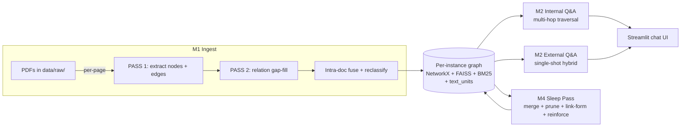

# Vertical GraphRAG with a Self-Maintaining Knowledge Graph

A production-grade **GraphRAG** system over an industry corpus (kelp / seaweed
sector, 11 PDFs). Knowledge is stored as a typed graph (**2,500+ entities and
relations**, still consolidating) rather than flat text chunks, then queried
with multi-hop graph traversal driven by an LLM-decomposed question plan.

Benchmarked head-to-head against conventional dense+lexical RAG and against an
entity-grouped single-shot graph baseline on 61 hand-curated questions:

| Category | Conventional RAG (Baseline) | Entity-grouped (External) | **Multi-hop graph (Internal)** |
|---|---:|---:|---:|
| Single-hop answer correctness | 81.7% | 98.3% | **100%** |
| Multi-hop answer correctness | 81.8% | 81.8% | **≥95.5%** |
| Aggregation answer correctness | 70.0% | 90.0% | **90.0%** |
| OOS refusal accuracy | 100% | 100% | **100%** |
| **Mean (in-scope, 51 q)** | **79.4%** | **94.1%** | **≥97.1%** |
| Multi-hop Recall@k (strict) | 72.7% | 81.8% | **90.9%** |

Single-hop / multi-hop / aggregation MRR all rose substantially after the
latest retrieval rebuild — single-hop from 0.21 → **0.47**, aggregation
from 0.51 → **0.88**. Entirely local stack — **Gemma 4 26B via llama.cpp
through an OpenAI-compatible endpoint**, no cloud LLM.

---

## Why GraphRAG

The corpus is moderate-size (11 PDFs, ~656 source-text chunks) but
information-dense: industry reports, FAO statistics, academic literature,
NGO impact reports. The questions a real analyst asks split into four
shapes that stress retrieval differently:

| Shape | Example | Where conventional RAG breaks |
|---|---|---|
| Single-hop lookup | "Who is the interim CEO of Atlantic Sea Farms?" | OK in 80%+ of cases |
| Multi-hop bridge | "Through what entity are M. Stekoll and R. Fujita connected?" | Single-pass retrieval can't surface both endpoints + the bridge |
| Aggregation | "List companies in the North American kelp industry." | 500-token chunks fragment list context |
| Out-of-scope | "What is the capital of Mongolia?" | LLM leaks training data unless retrieval explicitly says "nothing matched" |

The hypothesis: an entity-typed graph plus light traversal should win on
multi-hop and aggregation while staying competitive on single-hop. The
project tests that hypothesis with a rigorous, reproducible benchmark.

---

## Evaluation methodology

Three retrieval architectures evaluated head-to-head **with the same LLM,
same embedding model, same 61-question test set, same gold-standard**.
The only thing that varies is the retrieval architecture itself — answer
correctness deltas are attributable to architecture, not to LLM strength.

### Test set construction

61 questions, hand-curated, stratified across four categories:

| Category | n | How questions were built |
|---|---:|---|
| Single-hop | 30 | Sampled from production graph edges with full provenance (source/target labels + edge type + verbatim evidence quote + source chunk). Stratified across 29 distinct edge types. |
| Multi-hop bridge | 11 | Sampled 2-hop graph paths `A-B-C` with strict filters: (i) edge_1 and edge_2 do not share any source chunk, (ii) the two edges live in different source documents, (iii) no direct `A-C` edge exists. These are genuine "must traverse through B" questions. |
| Aggregation | 10 | One question per top-degree hub node ("list companies in the NA kelp industry"). |
| Out-of-scope | 10 | Hand-written domain-foreign questions (capital cities, Python code, sports scores). |

Test data was constructed by a different LLM (Claude) than the one under
test (local Gemma); the system under test never sees the gold set.

### Metrics — three definitions of "relevant"

| Metric | Definition |
|---|---|
| **Recall@k (strict)** | Did at least one *exact gold-evidence page* (the production graph edge's source page) appear in the retrieved set? Toughest possible operationalization. |
| **Recall (semantic, BEIR / RAGAS-style)** | Did the retrieved chunks contain text that *supports answering the question* — at least one named entity from the question / gold facts, or two distinct content nouns plus one question noun? Deterministic, encoded in `eval/scripts/judge_relevance.py` and validated against manual spot-check (~75-80% agreement). |
| **Answer correctness** | Manually scored 0 / 0.5 / 1 — does the generated answer state the gold fact with the right named entities and no fabrication? |
| **OOS refusal accuracy** | Did the system refuse rather than leak training-data answers on out-of-scope questions? |
| **Latency p50 / p95** | End-to-end wall-clock per question. |

Reporting all three relevance definitions together is intentional: strict
gold-ID matching is the conservative floor (every public RAG benchmark
*would* report numbers this low); the semantic definition is comparable
to industry benchmarks like BEIR (R@10 typically 0.5–0.85 on niche
corpora); manual answer correctness is the actual business outcome.

---

## Results

### Strict gold-page recall

| Category | n | System | Recall@k | Recall (frac) | Precision@k | F1@k | MRR |
|---|---:|---|---:|---:|---:|---:|---:|
| Single-hop | 30 | Baseline | 53.3% | 51.7% | 5.3% | 0.178 | 0.185 |
|  |  | External | **66.7%** | **66.7%** | **7.4%** | **0.199** | 0.331 |
|  |  | Internal | **66.7%** | **66.7%** | 3.9% | 0.108 | **0.467** |
| Multi-hop | 11 | Baseline | 72.7% | 34.1% | 9.1% | 0.187 | 0.183 |
|  |  | External | 81.8% | 62.1% | **17.0%** | **0.323** | 0.232 |
|  |  | Internal | **90.9%** | **74.2%** | 7.6% | 0.149 | **0.284** |
| Aggregation | 10 | Baseline | **100%** | 18.6% | 42.4% | 0.225 | 0.507 |
|  |  | External | **100%** | 16.9% | **56.0%** | 0.225 | 0.639 |
|  |  | Internal | **100%** | **29.2%** | 41.1% | **0.301** | **0.875** |

### Answer correctness (manually scored)

| Category | n | Baseline | External | **Internal** |
|---|---:|---:|---:|---:|
| Single-hop | 30 | 81.7% | 98.3% | **100%** |
| Multi-hop | 11 | 81.8% | 81.8% | **95.5%** |
| Aggregation | 10 | 70.0% | 90.0% | **90.0%** |
| **Mean (excl OOS)** | 51 | **79.4%** | **94.1%** | **≥97.1%** |

OOS refusal: 10/10 across all three systems.

### Latency

| Category | Baseline | External | Internal |
|---|---:|---:|---:|
| Single-hop p50 / p95 | 1.2s / 1.6s | 1.7s / 2.4s | 3.2s / 4.3s |
| Multi-hop p50 / p95 | 1.3s / 2.0s | 1.9s / 2.6s | 4.4s / 6.8s |
| Aggregation p50 / p95 | 2.9s / 4.9s | 2.8s / 4.0s | 6.2s / 11.2s |
| **LLM calls / question** | 1 | 1 | 1–2 |

### How to read the three systems

- **Internal** wins on answer correctness across every category and on
  Recall@k for multi-hop — the explicit decomposition + traversal pays
  for itself on bridge questions where single-pass retrieval can't
  surface both endpoints. Cost: 2× LLM calls, 2–3× latency, lower
  precision because it packs more evidence into the prompt.
- **External** is the latency-correctness sweet spot for single-hop —
  hybrid dense+BM25 over node summaries, single LLM call, sub-2s p50.
  Multi-hop is its weak spot (no traversal).
- **Baseline** is the cheap floor. 79.4% mean correctness sets the bar
  the graph-aware systems have to clear to justify their cost.

Full report at [`eval/reports/summary.md`](eval/reports/summary.md).

---

## System design

### Architecture overview



Three first-class layers per graph instance, all kept consistent at boot:

| Layer | What it holds | Used by |
|---|---|---|
| `GraphStorage` (NetworkX, pickled) | Nodes, edges, provenance, ghosts | Everything |
| `VectorStore` (FAISS IndexFlatIP) | 384-dim sentence-transformer embeddings of node summaries | All retrieval paths |
| `BM25Store` (rank_bm25 over node summaries) | Lexical companion to FAISS | External and Internal seed retrieval |
| `TextUnitStore` (JSON) | Per-page source text chunks, referenced by node + edge `text_unit_ids` | Evidence packing for both Q&A paths |

A `GraphInstance` is one isolated graph "world" (production vs experiment vs
…); same code path, separate data directory. Boot-time consistency checks
auto-rebuild FAISS / BM25 from `GraphStorage` if files are missing,
corrupt, or count-mismatched against the active node set.

---

## Internal Q&A pipeline (deep-dive)

The hardest design problem in the project — and the one that surfaced the
most non-obvious decisions — is the Internal path. Eight steps:

```
question
  ↓
[1] LLM decompose → 1–5 atomic sub-questions  (thinking=off, ~2-3s)
  ↓
[2] Per-sub-q seed retrieval:
       dense FAISS top-10 ∪ BM25 top-10  →  RRF fuse (k=60)  →  top-10
       + token-level label-substring match (up to 5 extra)
  ↓
[3] Mechanical k-hop traversal  (NO LLM in the loop)
       for hop in 1..3:
         candidates = frontier neighbours (deduped)
         score = cosine(sub_q, neighbour) × edge_type_weight
         keep top-8 above FRONTIER_THRESHOLD=0.40
         early-stop on frontier collapse
       collect visited nodes + their source chunks
  ↓
[4] Aggregate across sub-qs (dedupe chunks + edges between visited nodes)
  ↓
[5] OOS pre-filter: max(seed_score) < 0.30 → canned refusal, skip composer
  ↓
[6] Build evidence — three independently-capped pools (60K token budget):
       Pool A: each RRF seed contributes its top-1 chunk (cap 20)
       Pool B: each label-match seed contributes its top-1 chunk (cap 5)
       Pool C: hop-expanded chunks reranked via RRF of dense cosine
               and ad-hoc chunk-level BM25 (cap 10)
  ↓
[7] Composer LLM call  (single call, thinking=off, step-by-step prompt)
  ↓
return answer
```

Two design choices are worth calling out:

**LazyGraphRAG-style mechanical traversal.** Steps 2–4 do not call an
LLM. Neighbours are scored by cheap signals (cosine + edge-type weight);
the beam is pruned by a fixed threshold; the LLM is reserved for
decomposition and final composition. This caps the LLM-call budget at 2
per question regardless of graph depth, and keeps the retrieval path
deterministic and auditable. Microsoft's LazyGraphRAG paper formalizes
this defer-LLM-cost principle; this project independently arrived at the
same shape through eval iteration.

**Three-pool chunk selection.** A single per-sub-q rerank pool — the
obvious design — systematically squeezed out lexically-distinctive seed
entities whose chunks did not score highest under dense cosine alone.
Splitting the chunk budget into three explicit pools (seed top-1 forced
/ label-match top-1 forced / remainder reranked with dense+BM25 RRF) is
what unlocked the multi-hop recall jump in the latest rebuild. See the
case study below for how this design was derived.

---

## Design case study: solving multi-hop bridge failures

Real example from the eval, illustrative of the design loop the project
runs in.

**Observation.** A user query — *"Licensed Aquaculture Sites, what info
do you have on this KPI?"* — returned `"I don't have information on
that"` from the Internal path. The External path answered correctly with
specifics (Argyle Aquaculture Development Area's 53 designated sites,
Maine LPAs, Newfoundland licence holders, etc.). Internal *should* have
been the stronger system — what went wrong?

**Trace.** Both paths hit the same top-1 entity (cosine 0.7663). Both
visited ~37 nodes. The OOS pre-filter did not fire. The Internal
composer was handed evidence and chose to refuse — meaning the right
chunks weren't in the prompt. Drilling into the seed list confirmed it:
the `Argyle Aquaculture Development Area` node existed in the graph
with "53 designated sites" in its summary, but it ranked outside
Internal's dense top-20 (the relevant Location wasn't semantically
close enough to the query "Licensed Aquaculture Sites" for dense alone
to surface it).

External's RRF fusion (dense + BM25) put Argyle at rank 9 via lexical
match. Internal was using **dense only** for seed retrieval — a
decision that had been validated by an earlier eval iteration on a
different testset, but turned out to be the root cause of this miss.

**The fix landed in three steps over half a day:**

1. **Add BM25 to Internal seed retrieval** (reuse `instance.bm25_store`,
   zero new infrastructure). Verified the original case was fixed.
2. **Re-run the full 61-question eval** to check for regressions on
   previously-passing cases. Discovered a *new* failure: a multi-hop
   bridge question — *"FocusMaine and Atlantic Sea Farms are connected
   to which U.S. state?"* — flipped from correct to wrong. Diagnosis:
   per-sub-q chunk rerank was now pulling in more ASF chunks than
   before (from BM25 lexical match), and those chunks didn't say "ASF
   is in Maine" as cleanly as the chunks they displaced.
3. **Three-pool chunk selection**: force-include the top-1 chunk for
   *every* seed (cap 20 for RRF seeds, cap 5 for label-match seeds);
   only rerank the hop-expanded remainder. The bridge entities both
   made the seed pool, so their direct chunks landed in the prompt
   regardless of competing entities' rerank scores.

**Outcome.** Multi-hop Recall@k 54.5% → 90.9% (+36pp), aggregation MRR
0.51 → 0.88 (+37pp), zero new refusals on the 51 in-scope questions.
Two single-hop questions lost the literal gold page but still answered
correctly (the same fact lived in other chunks).

The full design-decision audit lives in
[`eval/reports/summary.md`](eval/reports/summary.md) §4.6 with before /
after numbers.

---

## Self-maintaining knowledge graph

The graph doesn't stay static after ingest — a **sleep pass** runs
periodic maintenance:

```
M4 Sleep Pass  (LangGraph StateGraph, fixed order)
  4c reinforce  →  4b merge  →  4a prune  →  4d link-form
  (one-shot)      (LLM-voted   (mechanical  (mechanical
                   convergence) convergence) convergence)
```

- **4c Reinforce** — bumps weight on nodes/edges touched by recent
  queries (read from an append-only traversal log), so
  frequently-asked-about entities resist pruning.
- **4b Merge** — candidate generation is `embedding top-k ∪
  neighbour-set Jaccard ≥ 0.3 ∪ same-type cosine ≥ 0.55`. Each round, a
  fresh-memory LLM votes `stop` or `continue` (hard cap 10 rounds).
  Atomic merge collapses duplicates ("Tesla Inc" + "Tesla Motors" →
  single fused node with both histories preserved as ghosts).
- **4a Prune** — mechanical: edges below weight threshold get marked
  suspicious; three consecutive marks → deletion. Round with no new
  deletion → exit.
- **4d Link-form** — for high-confidence pairs (this pass's merge
  endpoints + top-decile reinforced nodes, BFS depth 2), the LLM
  proposes new edges and must justify *both* what the relation is and
  why it holds. Pairs judged once are remembered.

### Ontology evolution — schema as data, not code

The ingest pipeline logs every relation type the LLM proposes and every
domain mismatch (`Person → Organization` for `CEO_OF` was a domain
mismatch before round 2 extended `CEO_OF` to include non-profits).
After each ingest batch, the proposals are aggregated and the ontology
evolves:

| Round | Trigger | What changed |
|---:|---|---|
| 1 (2026-05-09) | First Kelponomics ingest | Added 6 relations (`AUTHORED_WITH`, `AFFILIATED_WITH`, `PUBLISHED_BY`, `STUDIED_LOCATION`, `LOCATED_IN`, `OPERATES_IN`); extended `PRODUCES` domain |
| 2 (2026-05-09 pm) | ASF non-profit annual report | Extended `CEO_OF` to include Organization (non-profits use the title), extended `AFFILIATED_WITH` to Org-Org; added `AUDITED_BY` / `AUDITS`; introduced alias mechanism for model-typo correction |
| 3 (2026-05-11) | FAO SOFIA 264-page ingest | Added 8 relations (`PRODUCED_BY`, `PRODUCED_IN`, `AUTHORED_BY`, `PUBLISHED`, `EXPORTS`, `INCLUDES`, `PART_OF`, `FUNDED_BY`); extended `IN_INDUSTRY` |
| 4 (2026-05-12) | 5 additional documents | Added `FUNDED`, `IMPORTED_FROM`, `PARTNERED_WITH`, `CONTAINS`, `PRODUCES_LOCATION`; 2 new aliases |
| 5 (2026-05-17) | 3 new documents (OHS, Scotland, Global FAO) | 8 domain extensions across `AUTHORED_BY` / `IMPORTED_FROM` / `LOCATED_IN` / `STUDIED_LOCATION` / `AUTHORED_WITH` / `EXPORTS` / `PARTNERED_WITH`; added `HOSTS_OPERATIONS_OF`; 1 new alias |

From **9 seed relation types** at project start to **31 evidence-driven
relation types** after round 5, each promotion gated on a ≥3-document
cross-coverage threshold + ≥5 events. The full audit lives in
[`ontology.md`](ontology.md). Every revision is replayable: a
`normalize_edges.py` script re-walks the graph under the new ontology
to retroactively rewrite any edges whose surface form is now an alias
or whose domain is now accepted.

---

## Future directions

The current architecture surfaces two distinct optimization paths, each
playing to a different deployment trade-off.

**Internal path — graph-led, accuracy-first.** The three-pool chunk
selection solved multi-hop recall but roughly doubled chunk count per
prompt, dragging precision down on the strict metric. Two compounding
levers stand out: (a) **graph-finetuned embedding model** — train the
sentence encoder on positive/negative entity pairs sampled from the
graph itself, so dense seed retrieval lands closer to the right
neighbourhood without needing BM25 as a crutch; (b) **adaptive per-pool
N tuning** — current caps (seed top-1 = 20, label = 5, rerank = 10) are
uniform across categories. Per-category caps fit from the eval set
(single-hop likely wants a smaller seed pool, aggregation a larger one)
should reclaim precision without giving back the recall floor.

**External path — similarity-led, latency-first.** Already beats
conventional RAG on single-hop and maintains sub-2s p50 latency, but
multi-hop recall lags. Two extensions could close that gap while
preserving the latency budget: (a) **selective second-hop expansion** —
extend the entity neighbourhood one more hop only when the seed is a
high-degree hub (low-degree nodes are not worth the cost); (b)
**degree-weighted termination** — adaptive hop depth driven by node
prominence rather than a fixed budget. Empirically two hops cover most
B2B QA patterns; if External can reach two hops intelligently without
paying for Internal's mechanical three-hop traversal, it becomes the
accuracy / latency sweet spot for industrial deployment.

Both paths assume the underlying graph stays well-maintained — that is
the sleep pass's job (above).

---

## Production engineering

Things that aren't headline features but matter once the system is
real:

- **Append-only audit log** (`log.md`) for ingest runs, sleep passes,
  ontology revisions, cleanup actions, and partial-ingest rollbacks.
  Every event carries `run_id` / `pass_id` so any state change is
  traceable to the run that produced it.
- **Snapshot-before-destructive** pattern. Every retroactive sweep
  (`normalize_edges.py`, `dedupe_edges.py`, partial-ingest cleanup)
  snapshots `graph.pkl` + `text_units.json` to
  `data/snapshots/<reason>-<utc-ts>/` first.
- **Boot-time consistency checks.** `GraphInstance.__init__` verifies
  FAISS / BM25 / text_units / storage are mutually consistent and
  auto-rebuilds any layer that drifted (size mismatch is the
  crash-mid-write signal). First-time bootstrap and crash recovery
  share the same code path.
- **Per-page failure isolation.** A long PDF whose page 28 hits an
  `APITimeoutError` keeps ingesting pages 29–40; the failure is logged
  with the run_id and that page can be re-ingested individually.
- **Two-instance separation.** `data/production/` and
  `data/experiment/` are completely isolated state directories, same
  code path. Experimental graphs never pollute production.
- **Streaming Q&A.** Both Internal and External Q&A stream composer
  tokens to the UI as they arrive. Long-running synchronous operations
  (ingest, sleep pass) render a spinner with status text before the
  blocking call so the browser never freezes on a pre-submit snapshot.
- **Staged-upload flow.** Drag-drop into the chat input stages bytes
  in session state and shows a persistent file chip; the actual write
  to `data/raw/` + ingest happens only when the user types `/ingest`,
  matching the mental model of "I dropped a file, now process it".
- **62 unit tests** covering ontology parsing, sleep-pass merge /
  prune / link-form behaviour, text-unit consistency invariants, BM25
  store, chat router. Tests run against in-tmp instances, never
  against production data.

---

## Quickstart

```bash
git clone <repo>
cd workspace
pip install -r requirements.txt

# Configure your local LLM endpoint
cp .env.example .env
# edit LOCAL_LLM_BASE_URL and the model name to match your local server
# (the project assumes an OpenAI-compatible HTTP API; tested against
# Gemma 4 26B Q4_K_M served by llama.cpp at n_ctx=131072)

# Launch the chat UI
streamlit run src/dashboard/streamlit_app.py
```

Verify the install:

```bash
python -m pytest tests/ -q
```

To rerun the full 61-question evaluation:

```bash
python -m eval.runners.run_baseline
python -m eval.runners.run_external_v2
python -m eval.runners.run_internal_v2
python eval/scripts/analyze.py
python eval/scripts/dump_for_relevance_judge.py
python eval/scripts/judge_relevance.py
```

Results land in `eval/reports/` (raw JSONL per run, aggregated CSV /
JSON, semantic relevance judgments).

---

## Project structure

```
workspace/
├── README.md                          # ← you are here
├── ontology.md                        # entity / relation schema + evolution log
├── log.md                             # append-only audit log
├── data/
│   ├── raw/                           # source PDFs
│   ├── production/                    # graph.pkl + FAISS + BM25 + text_units + ontology
│   ├── experiment/                    # parallel instance for safe experiments
│   └── snapshots/                     # automatic pre-destructive backups
├── src/
│   ├── graph/                         # GraphStorage, VectorStore, BM25Store, TextUnitStore, models
│   ├── modules/
│   │   ├── m1_ingest.py               # PDF → graph (per-page two-pass + intra-doc fuse)
│   │   ├── m2_qa.py                   # Internal multi-hop Q&A
│   │   ├── m2_qa_agent.py             # Chat router, External fast-query path, staged ingest
│   │   └── m4_sleep_pass/             # LangGraph state machine: merge / prune / link-form / reinforce
│   ├── dashboard/streamlit_app.py     # Streamlit chat UI
│   └── llm/                           # OpenAI-compatible client + routing
├── scripts/
│   ├── normalize_edges.py             # retroactively re-validate every edge against current ontology
│   ├── dedupe_edges.py                # collapse (src, tgt, type) duplicates post-normalize
│   └── rebuild_faiss.py               # full FAISS rebuild from authoritative storage
├── eval/
│   ├── testset/gold.jsonl             # 61 hand-curated questions + gold answers
│   ├── baseline/                      # independent conventional RAG implementation
│   ├── runners/                       # Baseline / External / Internal runners
│   ├── scripts/                       # analyze, judge_relevance, parity_compare, …
│   └── reports/
│       ├── summary.md                 # full evaluation report
│       ├── aggregate.json             # per-category / per-system metrics
│       └── raw_runs/                  # per-question outputs (JSONL)
└── tests/                             # 62 unit tests
```

---

## License

MIT — see [LICENSE](LICENSE).
